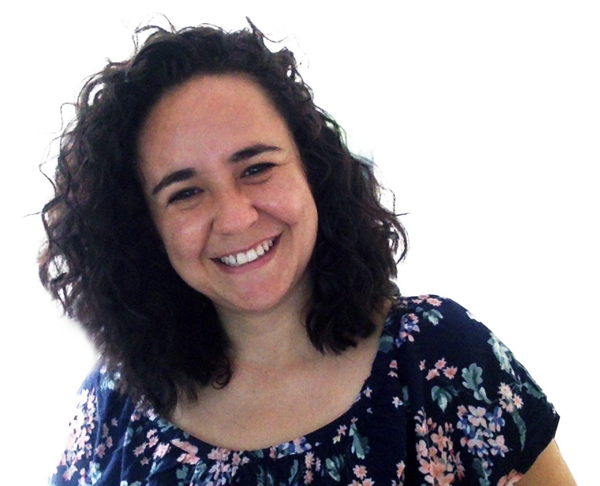

# Acerca dos autores {-}
***

##### MsC. Kelly Hidalgo {-} 

```{r Kelly, echo=FALSE, out.width="40%", out.height="40%", fig.align='center'}

```


Kelly atualmente é doutoranda do programa de Genética e Biologia Molecular da Universidade Estadual de Campinas. Desenvolve seu projeto de doutorado no *Centro Plurisdisciplinar de Pesquisa Químicas, Biológicas e Agricolas* (CPQBA - UNICAMP), na divisão de Recursos Microbianos no **Grupo de Ecologia Microbiana e Multi-ômicas** dirigido pela Doutora Valéria Maia Merzel. 
Kelly pesquisa principalmente sobre ambientes contaminados com petróleo ou derivados, abordagens de biorremediação, impacto da contaminação com microrganismos na industria petrolifera, usando multi-ômicas para melhor compreensão dos procesos microbiológicos que acontecem em estes ambientes. 

<div style="width:100%;text-align:center;">
[](https://orcid.org/0000-0003-4607-3750)   [](https://github.com/khidalgo85)
</div>
